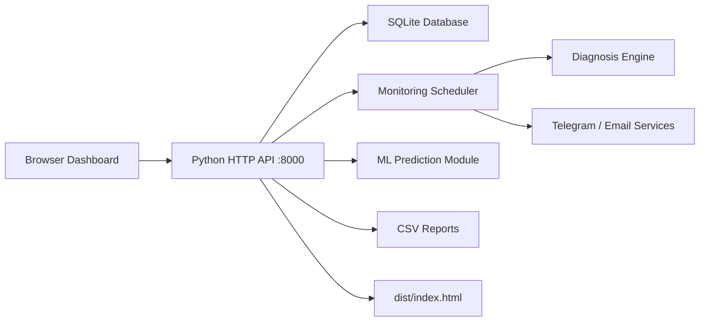

# Architecture

## High-Level Design

The application is a local-first monitoring platform with a Python backend, SQLite database, and browser-based enterprise dashboard.

## Runtime Components

| Component | Location | Responsibility |
|---|---|---|
| Frontend | `dist/index.html` | Main UI, dashboard, camera cards, topology, search, preferences |
| Backend API | `backend/app.py` | HTTP server, API routing, static file serving, auth checks |
| Database | `backend/cc_camera_demo.db` | SQLite persistence for cameras, alerts, logs, predictions, diagnosis, notifications |
| Schema and demo data | `backend/database.py` | Creates tables and inserts/backfills demo camera data |
| Diagnosis engine | `backend/diagnosis_engine.py` | Determines probable root cause and recommendations |
| Monitoring scheduler | `backend/monitoring/monitor_scheduler.py` | Periodic checks, status changes, notification triggers |
| Authentication | `backend/auth.py` | Login, session token validation, role checks |
| Analytics | `backend/analytics.py` | Summary and downtime analytics |
| Reports | `backend/reports.py` | CSV report generation |
| Topology | `backend/topology.py` | Switch/camera network topology data |

## Request Flow

1. User opens `http://127.0.0.1:8000`.
2. Backend serves `dist/index.html`.
3. Frontend calls `/api/...` endpoints.
4. Backend reads/writes SQLite and returns JSON.
5. Monitoring scheduler updates camera state and diagnosis data.
6. Frontend refreshes data without reloading the page.

## Authentication Flow

1. User submits login credentials to `/api/auth/login`.
2. Backend validates username and password using `backend/auth.py`.
3. Backend returns a token/session payload.
4. Protected API operations check user role.

Roles used by the backend include:

- `ADMINISTRATOR`
- `NETWORK_ENGINEER`

## Data Flow for Monitoring

1. Camera record contains name, IP, location, switch, switch IP, and RTSP URL.
2. Monitoring checks reachability, latency, RTSP/service status, and health.
3. Status changes are logged.
4. Diagnosis engine produces root cause, confidence, severity, and recommendation.
5. Alerts, diagnosis history, downtime logs, and notifications are persisted.
6. Dashboard and reports read the latest state from SQLite.

## Backward Compatibility

The backend preserves existing API routes and database usage. New read-only routes were added for diagnosis, recommendations, notification history, dashboard summary, platform status, and ML statistics.
